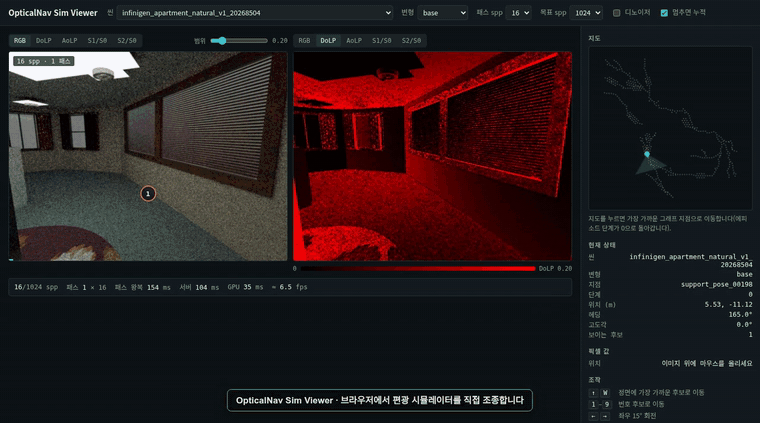
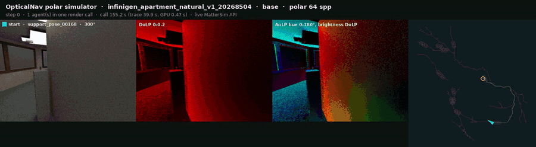
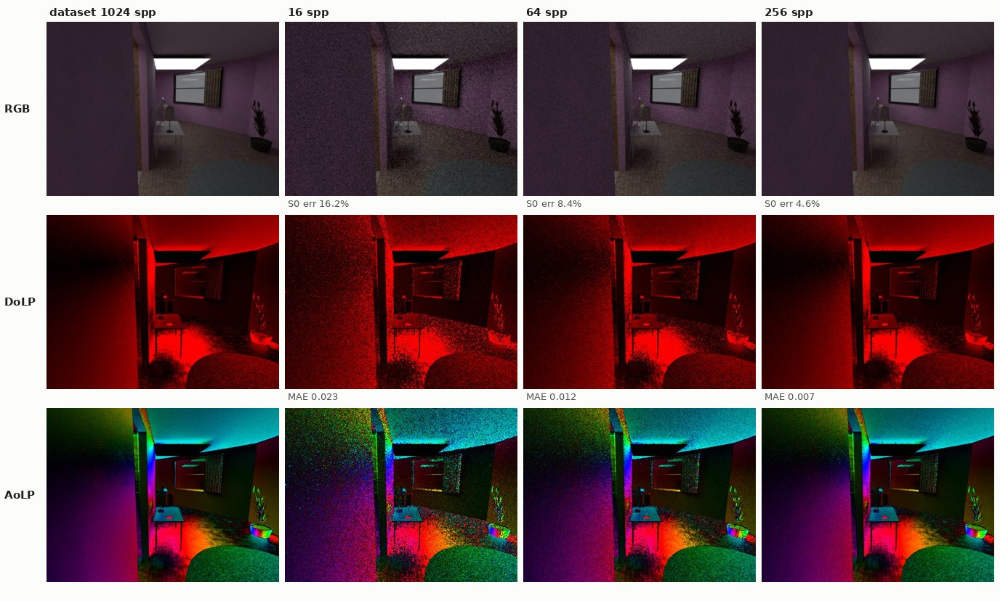
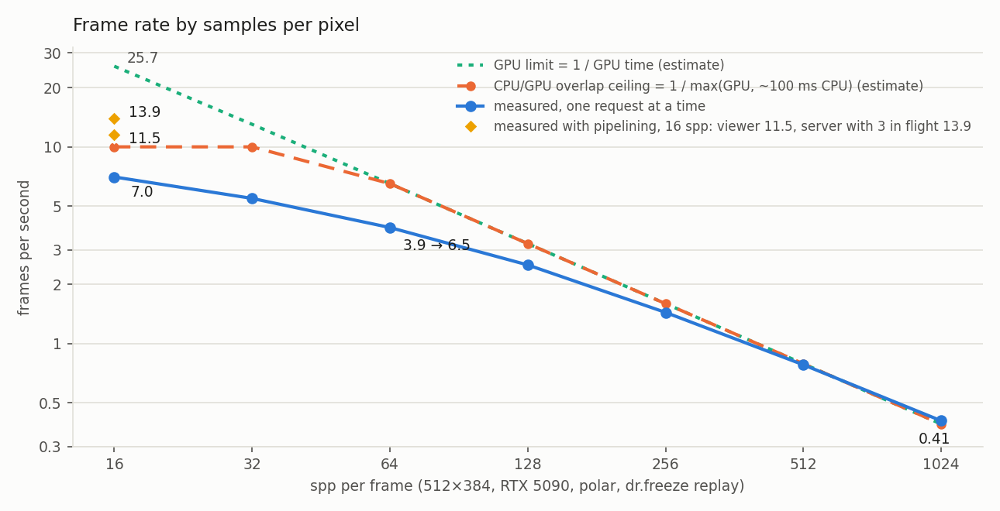

# OpticalNav Polar Simulator

A Matterport3DSimulator-compatible Python API for OpticalNav indoor scenes. Every observation is a physically based **polarization (Stokes) render** made on demand by Mitsuba 3. You can evaluate R2R-style agents in real time, on the graph or at free camera poses. The physics is the same as the OpticalNav dataset the agent was trained on.

```
  your agent ──► opticalnav_sim.MatterSim.Simulator ──HTTP──► render server (GPU, Mitsuba 3)
                 (same API as MatterSim)                       resident scene, Stokes integrator
                 graph logic runs locally                      scene packs: XML + meshes + textures
```

* **Interface.** `newEpisode`, `getState`, `makeAction`, `navigableLocations`, discretised viewing angles and init-only setters all behave as in [Matterport3DSimulator](https://github.com/peteanderson80/Matterport3DSimulator). R2R agent code runs after one import change.
* **Observations.** `state.rgb` is the polar camera's RGB preview (BGR, like MatterSim). `state.stokes` holds the linear Stokes images `s0`, `s1`, `s2`, `s3`, each HxWx3 RGB in the dataset's gravity-aligned basis.
* **Optical variants.** There are three: `base`, `perturbed` (mirrors and glass), and `active_polar` (perturbed plus a camera-aligned linearly polarized flash).
* **Data.** Connectivity is in Matterport3D format and annotations are in R2R format. The evaluation reports NE, OSR, SR and SPL, the same metrics as R2R `eval.py`.

## Demo

[](docs/media/viewer.mp4)

The browser viewer on an RTX 5090. Each move renders one 16 spp pass. While the camera stays put, passes accumulate up to 1024 spp. The second pane switches between DoLP, AoLP, S1/S0 and S2/S0, and the side panel shows the graph map and per-pixel Stokes values. Click the preview for the 40 s recording. It was made before W/A/S/D free movement was added.

[](docs/media/episode_polar.mp4)

An R2R episode driven through the MatterSim API, every frame rendered live at 64 spp. The panels are the RGB preview, DoLP (black to red over 0–0.2), AoLP (hue around the colour circle for 0–180°, brightness DoLP / 0.2), and the planned and travelled path. [Two agents rendered in one call](docs/media/two_agents.mp4) (7 s).

## Quick start

**Scene pack download:** `opticalnav-v0.2`, 13 verified scenes. Google Drive folder: `<DRIVE_FOLDER_LINK>` (to be filled in after upload). Fetch it with `tools/fetch_pack.py` (see *Sharing packs*).

**0. Build Mitsuba 3 on the GPU host** (once). The server needs the RGB polarized CUDA variants and `dr.freeze` (Mitsuba ≥ 3.6, Dr.Jit ≥ 1.0). *Environment setup* has the details, the plugins `active_polar` needs, and a check script.

```bash
git clone --recursive https://github.com/mitsuba-renderer/mitsuba3   # active_polar: use the robomituba fork instead
cd mitsuba3 && mkdir build && cd build
cmake -GNinja .. -DPython_EXECUTABLE=$(which python3.10) \
    -DMI_DEFAULT_VARIANTS=scalar_rgb,cuda_rgb,cuda_rgb_polarized,cuda_ad_rgb_polarized
ninja                                   # tens of minutes
source setpath.sh                       # WSL2: also export LD_LIBRARY_PATH=/usr/lib/wsl/lib:$LD_LIBRARY_PATH
python3.10 -c "import mitsuba as mi, drjit as dr; mi.set_variant('cuda_rgb_polarized'); print(mi.__version__, 'freeze', hasattr(dr, 'freeze'))"
```

`MI_DEFAULT_VARIANTS` applies only when `build/mitsuba.conf` does not exist yet. In an existing build directory, edit the `"enabled"` list in `mitsuba.conf` and run `cmake` again. The build imports only in the Python it was configured with (`Python_EXECUTABLE`), so run the server with that Python.

**1. Start a render server** on a GPU host that has the scene packs (`tools/fetch_pack.py`, see *Sharing packs*) and a Mitsuba build (see *Environment setup*).

```bash
PYTHONPATH=<mitsuba-build>/python python3.10 -m opticalnav_sim.server \
    --pack packs/opticalnav-v0.2 --port 18770 --preload infinigen_apartment_natural_v1_20268504
```

**2. Install the client.** It needs only Python 3.8+ and numpy. Point it at the server.

```bash
pip install -e .            # in this directory
export OPTICALNAV_SIM_URL=http://<server-host>:18770
```

**3. Use it like MatterSim.**

```python
import math
from opticalnav_sim import MatterSim

sim = MatterSim.Simulator()
sim.setDatasetPath("http://<server-host>:18770")       # render server (MatterSim: image dataset)
sim.setNavGraphPath("packs/opticalnav-v0.2/connectivity")  # optional: fetched from the server otherwise
sim.setDiscretizedViewingAngles(True)
sim.setBatchSize(1)
sim.initialize()

sim.newEpisode(["infinigen_apartment_natural_v1_20268504"], ["support_pose_00085"], [math.radians(90)], [0.0])
state = sim.getState()[0]
state.rgb                     # uint8 HxWx3, BGR
state.stokes["s1"]            # float16 HxWx3 linear Stokes S1 (RGB)
state.navigableLocations      # [current, candidates sorted by angle from image centre]
sim.makeAction([1], [0], [0]) # move to candidate 1; [0], [1], [0] turns right 30 degrees
```

**4. Run an R2R-style evaluation.**

```bash
python examples/run_agent.py --pack packs/opticalnav-v0.2 --split val_unseen --agent shortest --limit 25
python -m opticalnav_sim.eval --pack packs/opticalnav-v0.2 --split val_unseen --results results.json
```

Replace `choose_action` in `examples/run_agent.py` with your policy. Use `--no-render` to test graph logic without a server.

**5. Drive it by hand in a browser.** The viewer needs numpy and Pillow (`pip install -e .[gui]`).

```bash
python -m opticalnav_sim.gui --pack packs/opticalnav-v0.2 --server http://127.0.0.1:18770 --pass-spp 16 --target-spp 1024
# open http://127.0.0.1:18780 (from another machine or a phone: ssh -L 18780:127.0.0.1:18780 <host>)
```

The page has two camera panes, each showing RGB, DoLP, AoLP, S1/S0 or S2/S0 (one pane on a phone), a map of the graph, the Stokes values of the pixel under the mouse (or a tapped pixel), and a status bar for the viewer link, the render server, the loaded scene, the dr.freeze recording of the current settings, and the frame rate.

* **Moving.** W/A/S/D move freely (forward, left, back, right by the step size), Q/E lower and raise the camera, and dragging with the right mouse button turns the head (a plain right-click turns to the clicked point). ←/→ turn 15°, R/F look up and down, ↑ or 1–9 move to a graph candidate, ↓ turns around, and G snaps back to the nearest graph viewpoint. Space pauses accumulation. On touch screens a 3×3 button pad replaces the keys, a horizontal swipe turns, and a double tap turns to that point. Clicking the map jumps to the nearest viewpoint. Free movement has no collision check.
* **Rendering** runs on its own, like a game loop. Inputs only change the simulator state and are acknowledged at once. A background loop keeps `--depth` (default 2) passes of the newest camera in flight on the render server. Each pass is `--pass-spp` samples with its own seed; while the camera stays put, passes add up to a running mean until `--target-spp`, and the next input starts over. The seed is an input of the server's freeze recording, so one pass spp costs one recording however many passes run. The first frame for a pass spp records twice, about 150 s on Device 1 (see `Resident._settle`).
* **One WebSocket** (`/ws`) carries everything: the server pushes the state on every change and the panes' JPEGs for every new frame, and the page sends inputs and probes. The HTTP routes (`/api/state`, `/api/action`, …) remain for scripts.
* **Speed** on an RTX 5090 with a 16 spp pass: the page showed about 11.5 frames per second while accumulating, up from 6.3 when the page requested one pass at a time. The render server's main thread spends about 40–55 ms per view (camera update 15–30 ms, freeze replay ~23 ms) next to ~40 ms of GPU work, so views overlap only partly (88 → 72 ms per view with 1 → 3 requests in flight). S0 error against the dataset frame fell from 16.2% (1 pass) to 6.2% (8 passes) and 2.9% (64 passes), the same as one render of the same spp.

Render server options that matter here: `GET /v1/status` answers at once with what the server is doing (loading a scene, recording a freeze, rendering), the loaded scenes and their recorded settings. Views are pipelined: the server queues the next view's kernels before reading back the last one. `--kernel-history` adds per-kernel GPU times to `X-Render-Timing`, but reading them synchronises the GPU every view, so leave it off except for measurements (`tools/benchmark_modes.py`, `tools/frame_overhead.py`). `OPTICALNAV_SIM_FREEZE_INPUT=sensor` passes only the camera to the frozen render instead of the whole scene; it measured no faster.

**6. Replay exported OpticalNav episodes.** `tools/replay_episode.py` re-renders the episodes of an export (or a robomituba project, or this pack) step by step and writes them in the export bundle's layout.

```bash
python tools/replay_episode.py --pack packs/opticalnav-v0.2 --server http://127.0.0.1:18770 \
    --episodes <bundle dir | bundle.zip | bundle.zip.part000 | robomituba project | episode.json> \
    --scene infinigen_apartment_natural_v1_20268504 --split val_unseen --limit 2 \
    --variants base,perturbed --spp 64 --exposure scene --out runs/replay [--compare <bundle>]
```

* **Step to view.** Step i shows the dataset camera at `(path_nodes[i], path_headings[i])`, the key that `index.jsonl` joins on (`vp_id`, `heading_id`). Camera and base pose reproduce the dataset manifests exactly (checked on 40 views: camera error under 1e-15, base pose identical). Both `adaptive_navigation_support_v4` and the older `viewpoint_graph` episodes load.
* **Sources** (`opticalnav_sim.sources`). An unzipped bundle, `bundle.zip`, or the wizard's split upload (`bundle.zip.partNNN`, read in place as one file, so a 36 GB upload need not be joined or unzipped), a robomituba project, a pack, or one episode file.
* **Output** (`opticalnav_sim.bundle`). `index.jsonl` with the export's fields plus a `render` block (spp, seed, renderer), `images/<variant>/<frame>__polar_cam__<modality>.jpg`, `polarization_raw/<variant>/<frame>__polar_cam__stokes.npz` (float16 S0–S3, schema `minimal_rgb_stokes_f16_v2`), optional `hdr/…s0.exr`, `episodes/`, `graph/`, `dataset_meta.json`. Variants use the export's names (`perturbed_active_polar`). `--image-format none --hdr npz` writes HDR only.
* **Exposure** (`opticalnav_sim.tonemap`). LDR previews use robomituba's scene-global extended Reinhard. `--exposure scene` (the default) takes one exposure and white point from the scene's dataset reference frames, so a scene always renders at the same brightness. Other choices: `episode` (from the first frame), `fixed:<exposure>[,<white>]`, and `auto` (per frame, the legacy preview). On one 142-step episode the largest step-to-step brightness change was 17.6/255 with scene exposure and 76.6/255 with per-frame exposure.
* **Comparison.** `--compare` scores every frame against the dataset's own Stokes for that view (S0 error, S0 8×8 correlation, DoLP error) into `compare.jsonl`. robomituba prunes raw renders after export, so locally only the pack's reference frames remain; compare against an export bundle.
* **Speed.** On an RTX 5090 at 64 spp, two episodes (279 steps, 163 distinct frames) took 68 s, 0.41 s per frame including encoding.

**7. Generate new episodes.** `tools/generate_episodes.py` writes episodes in the dataset's v4 schema on a scene's navigation support graph; `replay_episode.py` then renders them like any other source.

```bash
python tools/generate_episodes.py --pack packs/opticalnav-v0.2 --scene infinigen_apartment_natural_v1_20268504 \
    --count 50 --split train --seed 0 --min-m 3 --max-m 30 --out runs/gen
python tools/replay_episode.py --pack packs/opticalnav-v0.2 --server http://127.0.0.1:18770 --episodes runs/gen \
    --scene infinigen_apartment_natural_v1_20268504 --variants base,perturbed --spp 64 --out runs/gen
```

* **Graph.** The support graph (`scenes/<scene>/navigation_support_graph.json`, copied into the pack by `build_pack.py`) is a state machine of support pose × 24 headings. Its transitions are `turn_left` / `turn_right` (15°) and `move_forward` (0.25 m along collision-checked lanes). Every generated step is one of those transitions (checked: 0 invalid in 20 episodes), and the episode, timestep and extras fields match the dataset's.
* **Routes.** A start state and a goal state are drawn under `--seed` with lane distance in `[--min-m, --max-m]`, then joined by the fewest-action route. `--goal-heading arrive` stops on arrival instead of turning to a drawn heading. robomituba chooses routes differently (blueprint routes, `global_room_length_balance_v1`; 76 of 80 dataset episodes checked were 1–60% longer than the fewest-action route). Its blueprint fields (`blueprint_id`, `pair_signature`, ...) are absent, and `metadata.episode_selection_policy` is `opticalnav_sim_fewest_actions_v1`.
* **Speed.** 20 episodes (43–260 steps) took 0.4 s; rendering one 216-frame episode at 64 spp took 87 s on an RTX 5090.

## Environment setup

The client side (agents, `MatterSim`, evaluation, the browser viewer) needs only Python and numpy (plus Pillow for the viewer). The render server needs an NVIDIA GPU, a Mitsuba 3 build with the right variants, and the scene packs. This section walks through the render host. The paths in the examples are Device 1's (RTX 5090, WSL2).

### 1. Host

| Item | Requirement | Device 1 |
|---|---|---|
| GPU | NVIDIA with OptiX; one resident scene takes about 10 GB, large residences more | RTX 5090, 32 GB, driver 580.97 |
| CUDA toolkit | only to build Mitsuba | 12.8 |
| OS | Linux, or WSL2 | WSL2 (Ubuntu) |
| Python | the version Mitsuba was built for | 3.10.12 (`/usr/bin/python3.10`) |

On WSL2 the CUDA driver library lives in `/usr/lib/wsl/lib`, so put it on the library path in every shell that imports Mitsuba:

```bash
export LD_LIBRARY_PATH=/usr/lib/wsl/lib:$LD_LIBRARY_PATH
```

### 2. Mitsuba 3

**Variants.** `polar` mode needs `cuda_rgb_polarized` (the server falls back to `cuda_ad_rgb_polarized`, which renders the same images but needs more GPU memory). `rgb` mode needs `cuda_rgb` or `cuda_ad_rgb`. A PyPI `mitsuba` wheel ships a fixed set of variants; check `mi.variants()`, and build from source when the RGB polarized variants are missing.

**Real-time rendering** needs `dr.freeze` (Dr.Jit ≥ 1.0 with Mitsuba ≥ 3.6; this code also passes `auto_opaque`, present in Dr.Jit 1.2). Without it every frame re-traces the scene, about 50 s per polar frame.

**Plugins for `active_polar`.** Scenes render through the robomituba fork of Mitsuba (`robomituba/modules/mitsuba3`): v3.7.1 plus the `polarized_area` emitter (commit `0b79cb01`, branch `stable`). Two-pass `active_polar` scenes also need the `path_nocaustics` integrator. In that tree it is still an uncommitted file (`src/integrators/path_nocaustics.cpp`, listed in `src/integrators/CMakeLists.txt`) and Device 1's current build does not contain it, so the server reports `path_nocaustics=False` and hides those variants. `base` and `perturbed` need neither plugin.

**Build** (once per host and Python version):

```bash
cd robomituba/modules/mitsuba3          # or: git clone --recursive https://github.com/mitsuba-renderer/mitsuba3
mkdir -p build && cd build
cmake -GNinja .. -DPython_EXECUTABLE=/usr/bin/python3.10 \
    -DMI_DEFAULT_VARIANTS=scalar_rgb,cuda_rgb,cuda_rgb_polarized,cuda_ad_rgb_polarized
# MI_DEFAULT_VARIANTS seeds build/mitsuba.conf when it is created. In an existing build directory, edit its
#   "enabled": ["scalar_rgb", "cuda_rgb", "cuda_rgb_polarized", "cuda_ad_rgb_polarized"]
# and run cmake -GNinja .. again.
ninja                                    # tens of minutes; each variant adds compile time
```

Device 1's build is at `/home/jinnyeong/robomituba-build/mitsuba3` and also enables `cuda_spectral`, `cuda_ad_spectral` and `cuda_ad_spectral_polarized`.

**Activate and check.** A build only imports in the Python it was configured with. With any other version, `import drjit` fails with "the Python version for which Dr.Jit was compiled (3.10.12) is incompatible with the current interpreter".

```bash
B=/home/jinnyeong/robomituba-build/mitsuba3
export LD_LIBRARY_PATH=/usr/lib/wsl/lib:$B:$LD_LIBRARY_PATH PYTHONPATH=$B/python   # or: source $B/setpath.sh
/usr/bin/python3.10 - <<'PY'
import mitsuba as mi, drjit as dr
print(mi.__version__, dr.__version__, "freeze:", hasattr(dr, "freeze"))
print([v for v in mi.variants() if v.startswith("cuda")])
mi.set_variant("cuda_rgb_polarized")
for plugin in ("polarized_area", "path_nocaustics"):
    try:
        mi.load_dict({"type": plugin}); print(plugin, "ok")
    except Exception as exc:
        print(plugin, "missing")
PY
```

On Device 1 this prints `3.7.1 1.2.0 freeze: True`, the CUDA variants, `polarized_area ok` and `path_nocaustics missing`.

### 3. Python packages

| Process | Python | Packages |
|---|---|---|
| render server (`opticalnav_sim.server`), `tools/check_parity.py` with a local renderer | the Mitsuba Python (3.10 on Device 1) | numpy, Pillow |
| `MatterSim` client, agents, `opticalnav_sim.eval`, replay and generation tools | any Python ≥ 3.8 | numpy (`pip install -e .`) |
| browser viewer (`opticalnav_sim.gui`), sample frames | any Python ≥ 3.8 | numpy, Pillow (`pip install -e .[gui]`) |
| `tools/record_episode.py` | any | numpy, Pillow, and the `ffmpeg` binary |

### 4. Scene packs

Build packs from a robomituba OpticalNav project with `tools/build_pack.py` (see *Scene packs*), or copy one from another host. With `--link hard` a pack costs no extra disk on the same filesystem; use `--link copy` for a pack you move elsewhere. Each scene folder holds its scene XMLs and assets (relative paths only), `scene.json`, the navigation support graph, the original episodes and a few dataset reference frames.

### 5. Start and warm up

```bash
cd opticalnav_sim
B=/home/jinnyeong/robomituba-build/mitsuba3
export LD_LIBRARY_PATH=/usr/lib/wsl/lib:$B:$LD_LIBRARY_PATH PYTHONPATH=$B/python:.
CUDA_VISIBLE_DEVICES=0 timeout 6h /usr/bin/python3.10 -u -m opticalnav_sim.server \
    --pack packs/opticalnav-v0.2 --port 18770 --modes polar --max-resident 1 \
    --preload infinigen_apartment_natural_v1_20268504:base:polar
```

* The start line should read `modes={'polar': 'cuda_rgb_polarized'} … freeze=True`.
* **Expect waits.** Loading a scene takes about 100 s (`--preload`, or the first request for it). The first frame of each spp and resolution records the freeze twice, about 150 s. Later frames replay in tens of milliseconds. Every scene or variant switch with `--max-resident 1` pays the load and the recordings again. `GET /v1/status` (and the viewer's status bar) says which of these is running.
* **GPU memory.** Use `--max-resident 1` when the GPU is shared. Freeze recordings failed twice when the card was nearly full, and a server whose recording failed fails every later render until it restarts.
* **Shared machines.** Start servers under `timeout` so a forgotten one does not hold the GPU. Bind beyond localhost only with a token (`--host 0.0.0.0 --token …`). On WSL2, other machines reach the port only after Windows forwards it (`netsh interface portproxy add v4tov4 listenport=18780 connectaddress=<WSL IP> connectport=18780` and a firewall rule).

### 6. Troubleshooting

| Symptom | Cause and fix |
|---|---|
| `ImportError: … Python version for which Dr.Jit was compiled (3.10.12) is incompatible` | wrong interpreter: run the Python the build was configured with |
| `libcuda.so` not found, or no CUDA device (WSL2) | `export LD_LIBRARY_PATH=/usr/lib/wsl/lib:$LD_LIBRARY_PATH` |
| `no Mitsuba variant for polar mode` | the build lacks `cuda_rgb_polarized` / `cuda_ad_rgb_polarized`: enable it in `mitsuba.conf` and rebuild |
| start line says `freeze=False` | Dr.Jit older than 1.0: every frame re-traces (~50 s polar); upgrade Mitsuba/Dr.Jit |
| `active_polar` missing for new scenes, `path_nocaustics=False` | build the fork with `path_nocaustics.cpp` |
| `record(): … not permitted` or `error encountered while recording a frozen function` | a freeze recording failed, usually with GPU memory nearly full; restart the server, keep `--max-resident 1`, free the GPU |
| the first frame takes minutes | a scene load or freeze recording; see `GET /v1/status` or the viewer's status bar |

## API

| MatterSim | opticalnav_sim | Notes |
|---|---|---|
| `setDatasetPath(path)` | render-server URL | default `$OPTICALNAV_SIM_URL` or `http://127.0.0.1:18770` |
| `setNavGraphPath(path)` | connectivity directory | optional; otherwise fetched from the server |
| `setCameraResolution(w, h)`, `setCameraVFOV(rad)` | same | default is the dataset polar camera: 512x384, 90° HFOV |
| `setElevationLimits`, `setDiscretizedViewingAngles`, `setRestrictedNavigation`, `setBatchSize`, `setSeed`, `setRenderingEnabled` | same | init-only where MatterSim's are |
| `setPreloadingEnabled`, `setCacheSize` | accepted, no effect | the server owns scene residency (`--max-resident`) |
| `setDepthEnabled(True)` | raises | polarization only |
| `newEpisode`, `newRandomEpisode`, `getState`, `makeAction`, `close`, `resetTimers`, `timingInfo` | same | |

State fields `scanId`, `step`, `rgb`, `depth`, `location`, `heading`, `elevation`, `viewIndex` and `navigableLocations` behave as in MatterSim. `ViewPoint` has `viewpointId`, `ix`, `x`, `y`, `z`, `rel_heading`, `rel_elevation` and `rel_distance`.

Extensions:

| Call | Purpose |
|---|---|
| `setVariant("base" \| "perturbed" \| "active_polar")` | Default optical variant. A scan id `<scene>__<variant>` overrides it per episode. |
| `setRenderMode("polar" \| "rgb")` | `polar` renders the dataset's Stokes sensor. `rgb` loads the same scene without the Stokes wrapper on a non-polarized variant, so it is faster and returns `state.radiance` only. |
| `setDenoiser(True)` | Runs the OptiX AI denoiser on every frame. In polar mode it denoises the images behind linear polarizers at 0°, 45°, 90° and 135°, `(S0±S1)/2` and `(S0±S2)/2`, then recombines S0, S1 and S2; S3 stays as rendered. |
| `setRenderSpp(n)`, `setRenderSeed(s)`, `setStokesDtype("float16" \| "float32")` | Noise and precision. Dataset frames used 1024 spp; the default is 64. |
| `teleport(scanIds, positions, headings, elevations)` | Start at free camera poses. A position is `[x, y, z]` in the connectivity frame, with z the height above the floor. `location.viewpointId` is the nearest viewpoint, and moving to a candidate snaps back onto the graph. |
| `renderCamera(scanId, camera_to_world)` | Render one raw dataset camera, such as `index.jsonl` `camera_to_world`. Returns `{rgb (RGB), s0..s3}`. |
| `state.radiance`, `state.stokes`, `state.camera_to_world`, `state.variant` | Linear RGB radiance (equal to S0 in polar mode), the polarization images (polar mode only), the exact camera that rendered them (dataset convention), and the variant used. |
| `opticalnav_sim.stokes.derived(s0, s1, s2)` | DoLP, AoLP and normalised S1/S0, S2/S0, computed as the dataset defines them. |
| `opticalnav_sim.RenderClient(url).render([...])` | Low-level batch rendering of dataset-convention cameras. |

## Conventions

* **Connectivity / state frame.** The frame is right-handed and z-up, like Matterport3D: `(x, -y_dataset, height)`. `heading` follows MatterSim: 0 looks along +y, and positive turns right. `elevation` is measured from the dataset camera's pitch (about -8.5 degrees), so `elevation = 0` reproduces dataset views exactly. Positive elevation looks up.
* **Joining with the training data.**
  * `viewpointId` is the dataset `vp_id`, a `support_pose_*` node of `navigation_support_graph.json`.
  * Dataset heading `h_XXX` is yaw XXX degrees. The simulator heading for it is `pi - radians(XXX)`, so discretised heading step k is `h_{(180 - 30k) mod 360}`.
  * `state.camera_to_world` uses the same row-major matrix convention as `index.jsonl`.
* **Camera.** At graph viewpoints the optical centre follows the dataset rig exactly. It sits at 1.5 m height, offset 0.1 m from the viewpoint in a heading-dependent direction. `tests/test_sim.py` reproduces stored dataset camera matrices to 1e-9. `teleport` puts the optical centre exactly at the given position.
* **Stokes.** The channels are linear RGB radiance per component, in reference basis `world_gravity_y_v1` (reference axis = world up), the same as the dataset `stokes_data.npz`.
* **Variants.** `active_polar` follows the protocol each scene was rendered with, recorded in `scene.json` as `variants.active_polar.protocol`.
  * `active_polar_flash_nocaustics_v1` (the re-rendered scenes) is `perturbed` plus a flash-only pass, summed as linear Stokes. The flash pass uses a camera-aligned linearly polarized `polarized_area` emitter and the `path_nocaustics` integrator.
  * `rgb_stokes_12_active_polar_compact_flash_v2` (older scenes) is a single pass with the room lights and a camera-aligned area flash together. In that protocol the polarizer sits behind the emitter, so the flash is effectively unpolarized. This matches those scenes' training data.

## Fidelity

Scene packs contain the exact Stokes scene files the dataset renderer loaded. For each variant this is the newest render version, found through the dataset's observation manifests. Each pack scene also stores a few dataset frames per variant under `reference/`, so parity stays checkable after the raw renders are gone.

```bash
python tools/check_parity.py --pack packs/opticalnav-v0.2 --scene <scene> --spp 256 [--variant base]
```

The check rebuilds the camera from viewpoint and heading (so it also tests the frame conventions) and compares Stokes images with the stored frame. Re-rendering a stored dataset view (`infinigen_apartment_natural_v1_20268504`, perturbed, `support_pose_00050` at `h_270`) gave these results.

| spp | mean S0 (dataset 0.3101) | mean abs S0 error / S0 |
|---:|---:|---:|
| 16 | 0.3101 | 4.5 % |
| 64 | 0.3100 | 2.4 % |
| 256 | 0.3100 | 1.3 % |

The residual falls with spp, so it is Monte Carlo noise rather than a scene difference. Through the full client and server path, a base view (`support_pose_00085` at `h_090`, 256 spp) gave these results.

| Check | Result |
|---|---|
| camera matrix error vs. dataset | 0.0 |
| mean S0 (simulator / dataset) | 0.18925 / 0.18922 |
| S0 correlation, 8×8 blocks | 0.99998 |
| S1 / S2 correlation, 8×8 blocks | 0.954 / 0.925 |

`scene.json` records where a pack cannot be exact:

* `variants_unavailable` lists variants whose staged scene file was deleted after rendering.
* `"inferred"` marks a variant whose scene file was matched by object ids because the dataset's observation manifests no longer exist. Those variants have no reference frames and are unverified.

### Frames by samples per pixel



`base`, `support_pose_00159` at `h_180`. DoLP is drawn black to red over 0–0.2. AoLP maps 0–180° once around the colour circle (0° and 180° red, 90° cyan), with brightness DoLP / 0.2 so weakly polarized light goes dark, and nothing of the RGB image underneath. Polarization is noisier than intensity, so DoLP and AoLP need more samples than S0 to approach the dataset frame. The errors are for this one view, so they differ slightly from the three-view averages in *Performance and hosting*.

## Performance and hosting

The scene is loaded once (25–35 s) and stays on the GPU. Dr.Jit's kernel history splits each frame into four parts: CPU tracing of the scene into JIT IR, code generation, compile, and GPU ray tracing. The server reports all four in the `X-Render-Timing` header. These are the measurements on Device 2 (RTX 3090, Dr.Jit 0.4, no `freeze`), at 512x384 and 128 spp with the scene resident:

| Mode / variant | CPU tracing | code generation | GPU ray tracing | frame | with freeze (GPU + post) |
|---|---:|---:|---:|---:|---:|
| rgb, `cuda_rgb` | 9.3 s | 1.8 s | 0.56 s | 11.7 s | 0.63 s (1.6 fps) |
| polar, `cuda_ad_rgb_polarized` | 40.8 s | 8.0 s | 2.33 s | 49–53 s | 2.5 s (0.4 fps) |
| polar, `cuda_rgb_polarized` (per 128-spp pass) | 41 s | 8.5 s | 2.31 s | about 50 s | 2.4 s |

* **Tracing dominates.** Tracing and code generation repeat on every render call, whatever the resolution or spp; a 64x48 frame at 1 spp still took 10.6 s. Compile only happens for a new resolution or kernel, since the camera pose is not baked into the kernel.
* **The AD and non-AD polarized variants trace at the same cost** on this build.
* **GPU time grows linearly with spp.** rgb measured 0.56, 1.17 and 2.34 s at 128, 256 and 512 spp.
* **Freeze removes the per-call overhead.** It records the render once and replays its kernels, so with freeze a frame costs only GPU time plus post-processing. The server enables it automatically when the build has it.

| Build | Polarized variant | Freeze | Use |
|---|---|---|---|
| Device 1 (RTX 5090, Mitsuba 3.7, OptiX 8) | `cuda_rgb_polarized` | yes | Realtime evaluation. The production dataset renderer measured 2.6–3.9 s per view at 1024 spp with 8–12 view batches. |
| Device 2 `mitsuba3-optix7` | `cuda_ad_rgb_polarized` (+ `cuda_rgb`) | no | Correctness checks, at about 50 s per polar pass and 11 s per rgb pass. |
| Device 2 `mitsuba3-optix7-rgbpolar` | `cuda_rgb_polarized` | no | Same tracing cost as AD; no speed gain. |

The first frame for each spp and resolution records the freeze, twice (the second call of a new recording records again, so the server pays both up front): about 150 s on Device 1. Later frames replay, for any camera and any seed. Use `--preload` to load scenes at start. Each server process serialises renders, and all Mitsuba calls run on its main thread; run one server per GPU to scale out. The server reads the pack's scene list at start, so restart it after adding scenes.

Without freeze, renders are split into passes to bound GPU memory: at most 64 spp in polar mode (`OPTICALNAV_SIM_SPP_CHUNK`) and 256 spp in rgb mode (`OPTICALNAV_SIM_SPP_CHUNK_RGB`). Each pass is traced again, so frame time grows with the number of passes.

At 128 spp and above, the OptiX denoiser changes frames by only about 0.5% and does not lower the error against the dataset. The noise left at those spp is small and texture-like.

To measure a build, run `tools/benchmark_modes.py`. It sweeps mode, spp and denoiser over the scene's dataset reference views. For each setting it reports steady-state fps with a render / denoise / post-processing breakdown, and S0 error against the 1024-spp dataset frame.

```bash
python tools/benchmark_modes.py --pack packs/opticalnav-v0.2 --scene infinigen_apartment_natural_v1_20268504 \
    --modes rgb,polar --spp 128,256,512,1024,2048 --denoise off,on --frames 3 --out bench.json
```

### Pipelining and the frame-rate ceiling



A server that handles one request at a time renders on the GPU, then post-processes and sends on the CPU, and the GPU idles meanwhile. Overlapping one frame's CPU work with the next frame's GPU work shortens the frame interval to the longer of the two. The estimate below was made from the measured GPU time and about 100 ms of CPU work per frame, before the overlap was built.

| spp | one request at a time | overlap ceiling (estimate) | GPU limit (estimate) | bottleneck |
|---:|---:|---:|---:|---|
| 16 | 7.0 | ≈ 10 | 25.7 | CPU |
| 32 | 5.5 | ≈ 10 | 13.0 | CPU |
| 64 | 3.9 | 6.5 | 6.5 | GPU |
| 128 | 2.5 | 3.2 | 3.2 | GPU |
| 256 | 1.44 | 1.6 | 1.6 | GPU |
| 1024 | 0.41 | 0.39 | 0.39 | GPU |

**Measured after building it (16 spp).** Pipelined views on the render server, camera-only updates and a render loop in the viewer brought the viewer to about 11.5 fps while accumulating (from 7.0). The render server alone reached 11.4, 12.7 and 13.9 fps with 1, 2 and 3 requests in flight. That is past the old estimate because the per-view CPU work fell from ~100 ms to ~45 ms (camera update 15–30 ms, freeze replay ~23 ms). It is still short of the GPU limit, because that CPU work is as long as the GPU work and the camera update waits for the previous view's GPU work.

* **Ceiling on one GPU at 512×384.** About 6.5 fps at 64 spp and 3.2 fps at 128 spp, where the GPU is the bottleneck. Below 32 spp the CPU side decides. Getting near the GPU limit (25.7 fps at 16 spp) needs the per-view CPU work cut further, for example double-buffered cameras so the update does not wait for the GPU.
* **One agent cannot overlap.** Its next action waits for the current observation. Overlap pays off only with several environments at once (`setBatchSize` N, several clients, or the viewer's render loop).
* **More GPUs.** Run one server per GPU; throughput grows almost linearly.

Self-hosting requirements are in *Environment setup*.

## Scene packs

`packs/opticalnav-v0.2` holds 16 scenes with 3,100 R2R episodes (2,324 train, 392 val_seen, 384 val_unseen).

* **Exceptions.**
  * `infinigen_office_20260823` and `infinigen_office_20260824` predate the support graph or have no renders, so they are not packed.
  * For `infinigen_apartment_natural_v1_20260827`, `_20260904` and `_20260828_lit_texturecan_v1_structural_pbr_v1`, variants are inferred and unverified.
  * The base variant of `large_residence_v1_20273004` is unavailable.
* **Episode length.** Episodes live on the 0.25 m support lattice, so a shortest-path agent needs about 230 steps per episode (30 m on average). R2R's panoramic graphs need about 5. The shortest-path agent in `examples/run_agent.py` reaches SR 1.0 / SPL 1.0 on val_unseen, which checks the graph, tasks and evaluator together.

Build packs with `tools/build_pack.py` from a robomituba OpticalNav project.

```bash
python tools/build_pack.py --project <robomituba>/out/opticalnav/opticalnav-v0.2 --out packs/opticalnav-v0.2 \
    [--scene SCENE ...] [--link hard|copy]
```

```
packs/<name>/
  connectivity/<scene>_connectivity.json   connectivity/scans.txt
  tasks/R2R/data/R2R_{train,val_seen,val_unseen}.json
  scenes/<scene>/{base,perturbed,active_polar,active_polar_flash}.xml  scene.json  r2r.json  assets/  reference/
  scenes/<scene>/navigation_support_graph.json  episodes/<split>/<episode_id>.json
```

Assets are hard links by default, so a pack costs no extra disk on the same filesystem. Use `--link copy` to produce a pack you can ship. Annotations follow R2R: `scan`, `path`, `heading`, `distance`, `instructions` and `path_id`, plus `episode_id`, `goal_node` and `actions`. Episodes come from the dataset's support-graph episodes with consecutive duplicate nodes removed.

### Sharing packs

A pack is too large for git (71 GB, 60,740 files, mostly text OBJ meshes), so the code travels through GitHub and the scenes through a shared folder, one compressed archive per scene.

**Receiving.** You need `tar` and `zstd` (Ubuntu: `apt install zstd`), plus `pip install gdown` for a Google Drive link.

```bash
git clone https://github.com/divisonofficer/OpticalNav_Sim && cd OpticalNav_Sim
python tools/fetch_pack.py --from <DRIVE_FOLDER_LINK> --out packs/opticalnav-v0.2 --list        # scenes on offer
python tools/fetch_pack.py --from <DRIVE_FOLDER_LINK> --out packs/opticalnav-v0.2 \
    --scene infinigen_apartment_natural_v1_20268504                                              # or all scenes
```

`fetch_pack.py` downloads only the scenes asked for and checks each archive's sha256 against `manifest.json` before it unpacks it. It then rewrites `pack.json`, `connectivity/scans.txt` and the R2R task files for the scenes present, so a partial pack works with the simulator and the evaluator. Run it again with more `--scene` options to add scenes later. `--from` also takes an rclone remote (`<remote>:path`) or a local folder.

**Sharing.** `tools/export_pack.py` writes the archives and the manifest. Upload the folder as is.

```bash
python tools/export_pack.py --pack packs/opticalnav-v0.2 --out packs/share-opticalnav-v0.2 --verified-only
rclone copy packs/share-opticalnav-v0.2 <remote>:dataset/opticalnav_sim/opticalnav-v0.2 --progress
rclone link <remote>:dataset/opticalnav_sim/opticalnav-v0.2   # a link anyone can open; or share the folder in Drive
```

`--verified-only` leaves out the three scenes whose variants were matched by object ids (`scene.json` "inferred"). Hard links are stored as files, so each archive unpacks on its own. A Drive folder link lists at most 50 files for gdown, which is plenty for one archive per scene. `<remote>` is an rclone remote of storage type `drive`, set up once with `rclone config`. On WSL2 the browser step opens a localhost URL that Windows reaches.

## Sharing a server

The server listens on `127.0.0.1` by default. To serve other machines, give it a token. It then refuses any request without `Authorization: Bearer <token>`, and it will not bind beyond localhost without one. Clients read the token from `OPTICALNAV_SIM_TOKEN`.

```bash
OPTICALNAV_SIM_TOKEN=<secret> python -m opticalnav_sim.server --pack ... --host 0.0.0.0
export OPTICALNAV_SIM_TOKEN=<secret> OPTICALNAV_SIM_URL=http://<server-host>:18770   # on the client
```

The protocol is plain HTTP and the token travels unencrypted. Across untrusted networks, prefer an SSH tunnel (`ssh -L 18770:127.0.0.1:18770 <gpu-host>`) or a VPN.

## Server HTTP API

| Endpoint | Returns |
|---|---|
| `GET /v1/info` | renderer, freeze, variants per scan, resident scenes |
| `GET /v1/scans` | scan ids |
| `GET /v1/scans/<scan>/meta` | camera rig, Stokes basis, variants, graph and episode counts |
| `GET /v1/scans/<scan>/connectivity` | connectivity JSON |
| `POST /v1/render` | Takes `{"views": [{scan, variant, camera_to_world 4x4, width, height, hfov_deg, spp, seed}], "stokes_dtype"}` and returns NPZ with `rgb_i`, `s0_i`..`s3_i` |

## Limitations

* No depth output.
* Requests to one server are serialised.
* `active_polar` needs the custom plugins.
* Success in `eval.py` uses R2R's 3 m radius by default (`--error-margin`). OpticalNav's own protocol used 0.5 m on its 0.25 m lattice.

## License

GPL-3.0-or-later. Rendering uses Mitsuba 3 (GPL-3.0).
